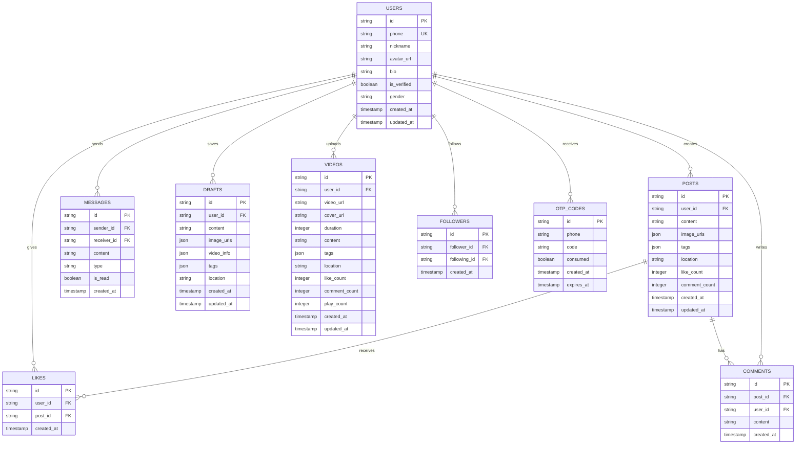

## 1. Architecture design


## 2. Technology Description

- **Frontend**: SwiftUI + Combine Framework + Kingfisher
- **Backend**: Dual backend architecture (Supabase + Go Server)
- **Database**: MySQL (Go backend) + PostgreSQL (Supabase)
- **Authentication**: Supabase Auth + SMS verification
- **Storage**: Supabase Storage + Local file uploads
- **Development Tool**: Xcode 15 + Swift 5.9 + Go 1.21
- **Network**: URLSession + Codable + Async/Await
- **Data Persistence**: UserDefaults + Core Data + FileManager

## 3. Route definitions

基于SwiftUI NavigationStack的页面导航结构：

| Route | Purpose |
|-------|---------|
| /launch | 启动页，检查登录状态和应用初始化 |
| /login | 登录页，手机号验证码登录 |
| /register | 注册页，完善用户信息和兴趣偏好 |
| /home | 首页，个性化推荐内容流 |
| /home/videos | 视频页，短视频推荐流 |
| /publish | 发布页，图文视频内容创作 |
| /publish/drafts | 草稿箱，草稿列表管理和续编辑 |
| /publish/camera | 相机页，内置拍摄和滤镜功能 |
| /message | 消息页，私信列表和系统通知 |
| /message/chat/{userId} | 聊天页，一对一私信对话 |
| /profile | 个人页，用户资料和个人作品 |
| /profile/edit | 资料编辑页，修改用户信息和设置 |
| /profile/history | 发布历史，个人发布记录管理 |
| /profile/likes | 我的点赞，点赞内容收藏管理 |
| /profile/followers | 粉丝列表，关注者管理 |
| /profile/following | 关注列表，已关注用户管理 |
| /search | 搜索页，用户和内容搜索 |
| /discover | 发现页，热门内容和话题挑战 |
| /discover/nearby | 附近页，基于地理位置的用户发现 |
| /discover/topics | 话题页，汉服相关话题聚合 |
| /settings | 设置页，账号和隐私设置 |
| /settings/privacy | 隐私设置，数据权限管理 |
| /settings/notifications | 通知设置，消息提醒配置 |

## 4. API definitions

### 4.1 Authentication APIs

#### 发送验证码
```
POST /api/auth/send_otp
```

Request:
| Param Name | Param Type | isRequired | Description |
|------------|------------|------------|-------------|
| phone | string | true | 手机号 (+86格式) |

Response:
| Param Name | Param Type | Description |
|------------|-------------|-------------|
| success | boolean | 发送状态 |
| debug_token | string | 开发环境调试用验证码 |

#### 验证登录
```
POST /api/auth/verify_otp
```

Request:
| Param Name | Param Type | isRequired | Description |
|------------|------------|------------|-------------|
| phone | string | true | 手机号 |
| token | string | true | 验证码 |

Response:
| Param Name | Param Type | Description |
|------------|-------------|-------------|
| token | string | JWT访问令牌 |
| user | object | 用户基础信息 |

### 4.2 User Management APIs

#### 创建用户
```
POST /api/users
```

Request:
| Param Name | Param Type | isRequired | Description |
|------------|------------|------------|-------------|
| phone | string | true | 手机号 |
| nickname | string | true | 用户昵称 |

#### 获取用户信息
```
GET /api/users/{id}
```

Response:
| Param Name | Param Type | Description |
|------------|-------------|-------------|
| id | string | 用户唯一标识 |
| phone | string | 手机号 |
| nickname | string | 用户昵称 |
| avatar_url | string | 头像URL |
| bio | string | 个人简介 |
| is_verified | boolean | 认证状态 |
| gender | string | 性别 |
| created_at | string | 创建时间 |
| updated_at | string | 更新时间 |

#### 更新用户资料
```
PATCH /api/users/{id}
```

Request:
| Param Name | Param Type | isRequired | Description |
|------------|------------|------------|-------------|
| nickname | string | false | 新昵称 |
| avatar_url | string | false | 新头像URL |
| bio | string | false | 新简介 |

### 4.3 Content Management APIs

#### 发布图文内容
```
POST /api/posts
```

Request:
| Param Name | Param Type | isRequired | Description |
|------------|------------|------------|-------------|
| user_id | string | true | 用户ID |
| content | string | true | 文本内容 |
| image_urls | array | false | 图片URL数组 |
| tags | array | false | 话题标签数组 |
| location | string | false | 位置信息 |

#### 获取内容列表
```
GET /api/posts
```

Query Params:
| Param Name | Param Type | isRequired | Description |
|------------|------------|------------|-------------|
| page | integer | false | 页码 (默认1) |
| limit | integer | false | 每页条数 (默认20) |
| user_id | string | false | 指定用户ID |
| tags | string | false | 标签筛选 |

#### 删除内容
```
DELETE /api/posts/{id}
```

#### 发布视频内容
```
POST /api/videos
```

Request:
| Param Name | Param Type | isRequired | Description |
|------------|------------|------------|-------------|
| user_id | string | true | 用户ID |
| video_url | string | true | 视频URL |
| cover_url | string | true | 封面图URL |
| duration | integer | true | 视频时长(秒) |
| content | string | false | 视频描述 |
| tags | array | false | 话题标签 |
| location | string | false | 位置信息 |

#### 获取视频列表
```
GET /api/videos
```

Query Params:
| Param Name | Param Type | isRequired | Description |
|------------|------------|------------|-------------|
| page | integer | false | 页码 (默认1) |
| limit | integer | false | 每页条数 (默认10) |
| auto_play | boolean | false | 是否自动播放 |

### 4.4 Social Interaction APIs

#### 点赞内容
```
POST /api/likes
```

Request:
| Param Name | Param Type | isRequired | Description |
|------------|------------|------------|-------------|
| post_id | string | true | 内容ID |
| user_id | string | true | 用户ID |

#### 取消点赞
```
DELETE /api/likes
```

Query Params:
| Param Name | Param Type | isRequired | Description |
|------------|------------|------------|-------------|
| post_id | string | true | 内容ID |
| user_id | string | true | 用户ID |

### 4.5 Message System APIs

#### 发送私信
```
POST /api/messages
```

Request:
| Param Name | Param Type | isRequired | Description |
|------------|------------|------------|-------------|
| sender_id | string | true | 发送者ID |
| receiver_id | string | true | 接收者ID |
| content | string | true | 消息内容 |
| type | string | false | 消息类型 (text/image) |

#### 获取私信列表
```
GET /api/messages
```

Query Params:
| Param Name | Param Type | isRequired | Description |
|------------|------------|-------------|
| user_id | string | true | 用户ID |
| other_user_id | string | true | 对方用户ID |

#### 获取会话列表
```
GET /api/conversations
```

Query Params:
| Param Name | Param Type | isRequired | Description |
|------------|------------|-------------|
| user_id | string | true | 用户ID |

#### 标记消息已读
```
POST /api/messages/{id}/read
```

#### 删除消息
```
DELETE /api/messages/{id}
```

### 4.6 Draft Management APIs

#### 保存草稿
```
POST /api/drafts
```

Request:
| Param Name | Param Type | isRequired | Description |
|------------|------------|------------|-------------|
| user_id | string | true | 用户ID |
| content | string | false | 文本内容 |
| image_urls | array | false | 图片URL数组 |
| video_info | object | false | 视频信息 {url, cover, duration} |
| tags | array | false | 话题标签数组 |
| location | string | false | 位置信息 |

#### 获取草稿列表
```
GET /api/drafts
```

Query Params:
| Param Name | Param Type | isRequired | Description |
|------------|------------|-------------|
| user_id | string | true | 用户ID |

#### 删除草稿
```
DELETE /api/drafts/{id}
```

### 4.7 File Upload APIs

#### 上传图片
```
POST /api/upload/image
```

Form Data:
| Param Name | Param Type | isRequired | Description |
|------------|------------|------------|-------------|
| file | file | true | 图片文件 |

Response:
| Param Name | Param Type | Description |
|------------|-------------|-------------|
| url | string | 上传后的文件URL |

#### 上传视频
```
POST /api/upload/video
```

Form Data:
| Param Name | Param Type | isRequired | Description |
|------------|------------|------------|-------------|
| file | file | true | 视频文件 |

#### 删除上传文件
```
POST /api/upload/delete
```

Request:
| Param Name | Param Type | isRequired | Description |
|------------|------------|------------|-------------|
| path | string | true | 文件路径 |

## 5. Server architecture diagram


## 6. Data model

### 6.1 Data model definition



### 6.2 Data Definition Language

#### 用户表 (users)
```sql
-- create table
CREATE TABLE users (
  id VARCHAR(36) PRIMARY KEY,
  phone VARCHAR(20) UNIQUE NOT NULL,
  nickname VARCHAR(50) NOT NULL,
  avatar_url TEXT,
  bio TEXT,
  is_verified BOOLEAN DEFAULT FALSE,
  gender VARCHAR(10) CHECK (gender IN ('male', 'female', 'other')),
  created_at TIMESTAMP DEFAULT CURRENT_TIMESTAMP,
  updated_at TIMESTAMP DEFAULT CURRENT_TIMESTAMP ON UPDATE CURRENT_TIMESTAMP
);

-- create index
CREATE INDEX idx_users_phone ON users(phone);
CREATE INDEX idx_users_nickname ON users(nickname);
CREATE INDEX idx_users_created_at ON users(created_at DESC);
```

#### 内容表 (posts)
```sql
-- create table
CREATE TABLE posts (
  id VARCHAR(36) PRIMARY KEY,
  user_id VARCHAR(36) NOT NULL,
  content TEXT NOT NULL,
  image_urls JSON,
  tags JSON,
  location VARCHAR(100),
  like_count INTEGER DEFAULT 0,
  comment_count INTEGER DEFAULT 0,
  created_at TIMESTAMP DEFAULT CURRENT_TIMESTAMP,
  updated_at TIMESTAMP DEFAULT CURRENT_TIMESTAMP ON UPDATE CURRENT_TIMESTAMP,
  FOREIGN KEY (user_id) REFERENCES users(id) ON DELETE CASCADE
);

-- create index
CREATE INDEX idx_posts_user_id ON posts(user_id);
CREATE INDEX idx_posts_created_at ON posts(created_at DESC);
CREATE INDEX idx_posts_tags ON posts((CAST(tags AS CHAR(255))));
```

#### 视频表 (videos)
```sql
-- create table
CREATE TABLE videos (
  id VARCHAR(36) PRIMARY KEY,
  user_id VARCHAR(36) NOT NULL,
  video_url TEXT NOT NULL,
  cover_url TEXT NOT NULL,
  duration INTEGER NOT NULL,
  content TEXT,
  tags JSON,
  location VARCHAR(100),
  like_count INTEGER DEFAULT 0,
  comment_count INTEGER DEFAULT 0,
  play_count INTEGER DEFAULT 0,
  created_at TIMESTAMP DEFAULT CURRENT_TIMESTAMP,
  updated_at TIMESTAMP DEFAULT CURRENT_TIMESTAMP ON UPDATE CURRENT_TIMESTAMP,
  FOREIGN KEY (user_id) REFERENCES users(id) ON DELETE CASCADE
);

-- create index
CREATE INDEX idx_videos_user_id ON videos(user_id);
CREATE INDEX idx_videos_created_at ON videos(created_at DESC);
```

#### 消息表 (messages)
```sql
-- create table
CREATE TABLE messages (
  id VARCHAR(36) PRIMARY KEY,
  sender_id VARCHAR(36) NOT NULL,
  receiver_id VARCHAR(36) NOT NULL,
  content TEXT NOT NULL,
  type VARCHAR(20) DEFAULT 'text' CHECK (type IN ('text', 'image')),
  is_read BOOLEAN DEFAULT FALSE,
  created_at TIMESTAMP DEFAULT CURRENT_TIMESTAMP,
  FOREIGN KEY (sender_id) REFERENCES users(id) ON DELETE CASCADE,
  FOREIGN KEY (receiver_id) REFERENCES users(id) ON DELETE CASCADE
);

-- create index
CREATE INDEX idx_messages_sender_id ON messages(sender_id);
CREATE INDEX idx_messages_receiver_id ON messages(receiver_id);
CREATE INDEX idx_messages_created_at ON messages(created_at DESC);
```

#### 点赞表 (likes)
```sql
-- create table
CREATE TABLE likes (
  id VARCHAR(36) PRIMARY KEY,
  user_id VARCHAR(36) NOT NULL,
  post_id VARCHAR(36) NOT NULL,
  created_at TIMESTAMP DEFAULT CURRENT_TIMESTAMP,
  UNIQUE KEY unique_like (user_id, post_id),
  FOREIGN KEY (user_id) REFERENCES users(id) ON DELETE CASCADE,
  FOREIGN KEY (post_id) REFERENCES posts(id) ON DELETE CASCADE
);

-- create index
CREATE INDEX idx_likes_user_id ON likes(user_id);
CREATE INDEX idx_likes_post_id ON likes(post_id);
```

#### 草稿表 (drafts)
```sql
-- create table
CREATE TABLE drafts (
  id VARCHAR(36) PRIMARY KEY,
  user_id VARCHAR(36) NOT NULL,
  content TEXT,
  image_urls JSON,
  video_info JSON,
  tags JSON,
  location VARCHAR(100),
  created_at TIMESTAMP DEFAULT CURRENT_TIMESTAMP,
  updated_at TIMESTAMP DEFAULT CURRENT_TIMESTAMP ON UPDATE CURRENT_TIMESTAMP,
  FOREIGN KEY (user_id) REFERENCES users(id) ON DELETE CASCADE
);

-- create index
CREATE INDEX idx_drafts_user_id ON drafts(user_id);
CREATE INDEX idx_drafts_updated_at ON drafts(updated_at DESC);
```

#### 关注关系表 (followers)
```sql
-- create table
CREATE TABLE followers (
  id VARCHAR(36) PRIMARY KEY,
  follower_id VARCHAR(36) NOT NULL,
  following_id VARCHAR(36) NOT NULL,
  created_at TIMESTAMP DEFAULT CURRENT_TIMESTAMP,
  UNIQUE KEY unique_follow (follower_id, following_id),
  FOREIGN KEY (follower_id) REFERENCES users(id) ON DELETE CASCADE,
  FOREIGN KEY (following_id) REFERENCES users(id) ON DELETE CASCADE
);

-- create index
CREATE INDEX idx_followers_follower_id ON followers(follower_id);
CREATE INDEX idx_followers_following_id ON followers(following_id);
```

#### 验证码表 (otp_codes)
```sql
-- create table
CREATE TABLE otp_codes (
  id VARCHAR(36) PRIMARY KEY,
  phone VARCHAR(20) NOT NULL,
  code VARCHAR(6) NOT NULL,
  consumed BOOLEAN DEFAULT FALSE,
  created_at TIMESTAMP DEFAULT CURRENT_TIMESTAMP,
  expires_at TIMESTAMP NOT NULL,
  INDEX idx_otp_phone (phone),
  INDEX idx_otp_created_at (created_at DESC)
);
```

## 7. Security Configuration

### 7.1 Authentication Security
- **JWT Token**: 使用JWT进行用户身份验证，有效期24小时
- **Refresh Token**: 支持自动刷新机制，延长用户会话
- **SMS Rate Limiting**: 同一手机号60秒内只能发送一次验证码
- **OTP Expiration**: 验证码有效期为5分钟
- **Phone Verification**: 强制手机号验证，防止恶意注册

### 7.2 Data Security
- **Password Security**: 不存储明文密码，使用哈希加密
- **Data Encryption**: 敏感数据传输使用HTTPS加密
- **Input Validation**: 所有用户输入进行严格验证和过滤
- **SQL Injection Prevention**: 使用参数化查询防止SQL注入
- **File Upload Security**: 限制文件类型和大小，防止恶意文件上传

### 7.3 Privacy Protection
- **Phone Number Masking**: 用户手机号脱敏显示
- **Privacy Settings**: 用户可控制个人资料可见性
- **Content Moderation**: 内容审核机制，防止违规内容
- **Data Retention**: 用户注销后数据清理策略
- **GDPR Compliance**: 符合数据保护法规要求

### 7.4 API Security
- **Rate Limiting**: API请求频率限制，防止滥用
- **CORS Configuration**: 跨域请求安全配置
- **API Key Management**: 敏感API使用密钥验证
- **Request Logging**: 完整的请求日志记录
- **Error Handling**: 安全的错误信息返回，不泄露系统信息

## 8. Performance Optimization

### 8.1 Caching Strategy
- **Image Caching**: Kingfisher实现智能图片缓存
- **API Response Cache**: 常用数据接口缓存机制
- **User Session Cache**: 用户会话信息本地缓存
- **Content Preloading**: 内容预加载优化用户体验

### 8.2 Database Optimization
- **Index Optimization**: 关键字段索引优化
- **Query Optimization**: SQL查询性能优化
- **Connection Pooling**: 数据库连接池管理
- **Data Pagination**: 大数据分页查询

### 8.3 Network Optimization
- **Request Compression**: GZIP压缩减少传输数据量
- **CDN Integration**: 静态资源CDN加速
- **Lazy Loading**: 图片和内容懒加载
- **Offline Support**: 离线模式支持

## 9. Monitoring and Analytics

### 9.1 Application Monitoring
- **Crash Reporting**: 崩溃日志收集和分析
- **Performance Monitoring**: 应用性能指标监控
- **User Analytics**: 用户行为数据分析
- **Error Tracking**: 错误日志追踪和分析

### 9.2 Business Analytics
- **Content Analytics**: 内容发布和消费分析
- **User Engagement**: 用户参与度分析
- **Growth Metrics**: 用户增长和留存分析
- **Revenue Tracking**: 收益和商业化指标

## 10. Deployment Architecture

### 10.1 iOS App Distribution
- **App Store**: 通过Apple App Store发布
- **TestFlight**: 内测版本分发
- **Enterprise**: 企业内部分发方案

### 10.2 Backend Deployment
- **Containerization**: Docker容器化部署
- **Load Balancing**: 负载均衡和高可用
- **Auto Scaling**: 自动扩缩容配置
- **Database Backup**: 数据库备份和恢复策略
