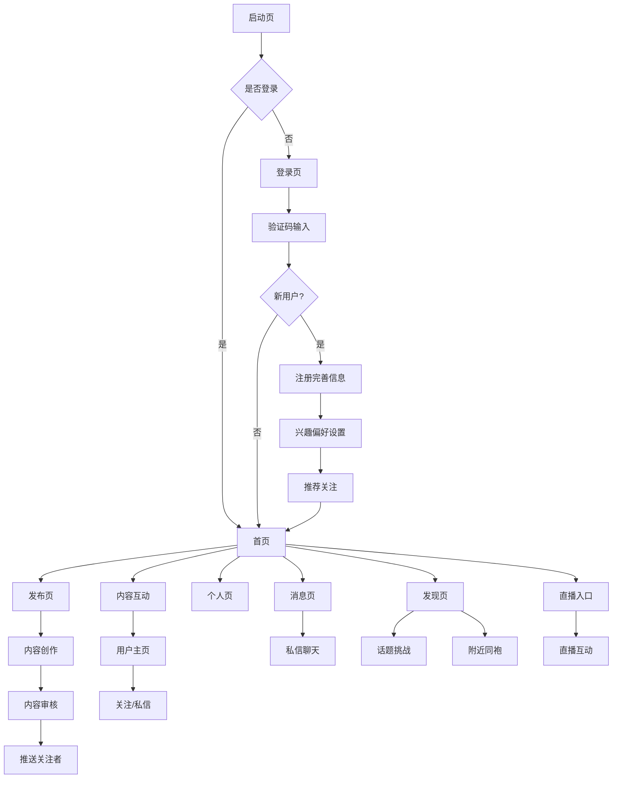

## 1. Product Overview

明制汉服社区iOS应用，专注于汉服文化爱好者的垂直社交平台。为用户提供汉服穿搭分享、文化交流、同袍互动的专属空间，通过图文、视频、直播等多元化内容形式构建活跃的汉服文化生态圈。

* 解决汉服爱好者缺乏专业交流社区的问题，提供便捷的同袍互动平台，促进汉服文化传承与发展

* 目标用户为汉服文化爱好者、传统文化传承者、国风摄影师、汉服设计师、汉服商家等群体

* 市场价值在于填补汉服垂直社交领域的空白，打造汉服文化生态圈，推动传统文化数字化传播

## 2. Core Features

### 2.1 User Roles

| Role  | Registration Method | Core Permissions           |
| ----- | ------------------- | -------------------------- |
| 普通用户  | 手机号验证码注册            | 浏览内容、发布图文视频、点赞评论、私信交流、关注用户 |
| 认证用户  | 申请认证升级              | 获得认证标识、优先推荐、专属客服、商家功能      |
| 内容创作者 | 粉丝数达标自动升级           | 数据分析、内容推广、收益分成、直播权限        |
| 管理员   | 后台设置                | 内容审核、用户管理、违规处理、推荐算法调优      |

### 2.2 Feature Module

汉服社区应用主要包含以下核心功能模块：

1. **首页**: 个性化推荐流、朝代分类、搜索发现、热门话题、视频专区
2. **发布页**: 图文创作、视频录制、滤镜美化、话题标签、草稿管理、定时发布
3. **消息页**: 私信聊天、系统通知、互动提醒、群聊功能、客服支持
4. **个人页**: 用户资料、作品展示、数据统计、隐私设置、账号管理
5. **登录页**: 手机号登录、验证码验证、注册完善、第三方登录
6. **发现页**: 热门内容、话题挑战、附近同袍、推荐用户、活动专区
7. **直播页**: 直播推流、弹幕互动、礼物打赏、回放管理、直播预约

### 2.3 Page Details

| Page Name | Module Name | Feature description           |
| --------- | ----------- | ----------------------------- |
| 登录页       | 手机号输入       | 输入11位手机号，支持一键清除、格式验证、国际区号选择   |
| 登录页       | 验证码登录       | 发送6位验证码，60秒倒计时，支持语音验证码重发      |
| 登录页       | 新用户注册       | 完善昵称、头像、性别、朝代偏好、兴趣标签等基础信息     |
| 登录页       | 第三方登录       | 支持微信、QQ、微博等快捷登录方式             |
| 首页        | 推荐算法        | 基于用户兴趣、互动行为、地理位置的个性化内容推荐      |
| 首页        | 内容流展示       | 图文混排展示，支持单图、多图、视频等不同内容形式      |
| 首页        | 朝代分类        | 明制、唐制、宋制、晋制等朝代风格内容分类浏览        |
| 首页        | 搜索发现        | 关键词搜索用户、话题、内容，支持热门搜索和搜索历史     |
| 首页        | 话题标签        | #明制汉服# #汉服穿搭# #传统文化# 等话题聚合展示  |
| 发布页       | 图片上传        | 支持9张图片选择，九宫格展示，图片裁剪、旋转、滤镜     |
| 发布页       | 视频录制        | 支持15秒-3分钟短视频，内置美颜滤镜，背景音乐添加    |
| 发布页       | 内容编辑        | 文字输入、话题标签#、@用户提及、emoji表情、位置标记 |
| 发布页       | 滤镜美化        | 提供汉服风格滤镜（古典、淡雅、明艳）、亮度对比度调节    |
| 发布页       | 草稿管理        | 自动保存草稿，手动保存草稿，草稿列表管理、续编辑      |
| 发布页       | 定时发布        | 支持设置发布时间，定时推送到关注者时间线          |
| 消息页       | 私信列表        | 显示聊天记录，未读消息提醒，支持左滑删除对话        |
| 消息页       | 私信聊天        | 发送文字、图片、语音，支持表情包，消息已读状态       |
| 消息页       | 系统通知        | 点赞、评论、关注、官方公告等通知聚合展示          |
| 消息页       | 互动提醒        | 新粉丝提醒、评论回复提醒、@提及提醒            |
| 消息页       | 客服支持        | 在线客服对话，常见问题解答，意见反馈收集          |
| 个人页       | 资料展示        | 头像、昵称、简介、认证标识、背景图、个人统计        |
| 个人页       | 作品管理        | 个人发布内容列表，支持编辑删除，设置可见性         |
| 个人页       | 数据统计        | 获赞数、粉丝数、关注数、作品数等数据统计展示        |
| 个人页       | 隐私设置        | 账号可见性、私信权限、内容下载权限等隐私控制        |
| 个人页       | 账号管理        | 手机号更换、密码修改、账号注销、数据导出          |
| 个人页       | 我的收藏        | 收藏的内容管理，支持分类整理和快速查找           |
| 个人页       | 浏览历史        | 最近浏览的内容记录，支持清空和历史管理           |
| 发现页       | 热门内容        | 基于全平台热度的优质内容推荐                |
| 发现页       | 话题挑战        | 定期推出汉服相关话题挑战活动                |
| 发现页       | 附近同袍        | 基于地理位置的同城汉服爱好者发现              |
| 发现页       | 推荐用户        | 系统推荐的优质内容创作者和活跃用户             |
| 发现页       | 活动专区        | 线上线下汉服活动信息发布和报名管理             |
| 直播页       | 直播推流        | 支持RTMP推流，多清晰度选择，美颜滤镜          |
| 直播页       | 弹幕互动        | 实时弹幕发送，礼物打赏，点赞互动              |
| 直播页       | 直播预约        | 提前发布直播预告，粉丝预约提醒               |
| 直播页       | 回放管理        | 直播录制回放，支持剪辑和二次发布              |

## 3. Core Process

### 3.1 用户注册登录流程

新用户通过手机号验证码完成注册，完善基础信息和兴趣偏好，系统根据朝代偏好推荐关注用户，进入首页浏览个性化内容。

### 3.2 内容创作发布流程

用户点击发布按钮，选择图片或录制视频，添加滤镜效果和文字描述，选择相关话题标签，可保存草稿或立即发布，内容经过审核后推送给关注者。

### 3.3 社交互动流程

用户在首页浏览内容，通过点赞、评论、转发等方式互动，点击用户头像进入个人主页，可选择关注或发送私信，建立同袍社交关系。

### 3.4 内容发现流程

用户通过搜索、话题、分类等方式发现感兴趣的内容，系统根据用户行为数据优化推荐算法，提供个性化的内容发现体验。

## 4. User Interface Design

### 4.1 Design Style

* **主色调**: 中国红 (#DC143C) + 古典金 (#FFD700) + 墨黑 (#2C2C2C) + 宣纸白 (#FAF8F3)

* **辅助色系**: 青花蓝 (#1E3A8A)、朱砂红 (#B91C1C)、翡翠绿 (#059669)、淡雅灰 (#6B7280)

* **按钮风格**: 圆角矩形设计，渐变背景效果，国风纹样装饰，点击水波纹反馈

* **字体规范**: 苹方黑体为主，标题20pt，正文16pt，说明14pt，强调字重600

* **图标风格**: 线性图标+国风元素，如云纹、回纹、花卉纹样、传统器物造型

* **动效设计**: 传统折扇展开、梅花绽放、祥云旋转等国风动画效果

### 4.2 Page Design Overview

| Page Name | Module Name | UI Elements                    |
| --------- | ----------- | ------------------------------ |
| 登录页       | 背景区域        | 汉服美人背景图，毛玻璃效果，品牌Logo居中，祥云纹样装饰  |
| 登录页       | 输入区域        | 手机号输入框白底圆角，获取验证码按钮中国红，传统纹样边框   |
| 首页        | 顶部导航        | 搜索框+分类标签，背景宣纸纹理，金色边框装饰，动态标题    |
| 首页        | 内容卡片        | 白底卡片+阴影，图片16:9比例，用户信息横向排列，朝代标签 |
| 首页        | 底部导航        | 传统纹样图标，选中状态红色高亮，未读消息红点提示       |
| 发布页       | 图片选择        | 宫格式图片展示，选中状态红色边框，支持拖拽排序，滤镜预览   |
| 发布页       | 编辑区域        | 文本输入框仿宣纸效果，话题标签红色高亮，@用户蓝色显示    |
| 发布页       | 工具栏         | 图片、视频、位置、话题工具按钮，国风图标设计         |
| 消息页       | 会话列表        | 头像圆形56pt，未读红点提示，时间戳右对齐，在线状态    |
| 消息页       | 聊天界面        | 聊天气泡设计，我方红色渐变，对方白底灰边，已读状态      |
| 个人页       | 头部区域        | 背景图虚化效果，头像圆形80pt带白边，认证金标，关注按钮  |
| 个人页       | 内容网格        | 三列宫格展示，图片1:1比例，点赞数叠加显示，朝代标签    |
| 发现页       | 分类导航        | 朝代分类图标，横向滑动切换，选中状态红色高亮         |
| 发现页       | 活动卡片        | 活动海报展示，时间地点信息，报名按钮，参与人数        |
| 直播页       | 直播窗口        | 16:9视频播放区域，弹幕叠加显示，礼物动画效果       |
| 直播页       | 互动区域        | 聊天输入框，礼物选择面板，点赞按钮，分享功能         |

### 4.3 Responsiveness

采用iOS原生Auto Layout和Size Classes适配方案：

* **基础设计**: 以iPhone 14 Pro (393×852pt) 为基准设计稿

* **设备适配**: 支持iPhone全系列，从SE到Pro Max，自动适配屏幕尺寸

* **安全区域**: 适配动态岛和刘海屏，内容避开安全区域显示

* **深色模式**: 自动切换配色方案，背景深色，内容保持可读性

* **横竖屏**: 核心功能竖屏优先，部分页面支持横屏展示更多内容

* **iPad优化**: 利用大屏优势，采用侧边栏和分栏布局，提升信息密度

* **字体缩放**: 支持系统字体大小设置，确保内容可读性

### 4.4 交互设计规范

* **下拉刷新**: 传统折扇展开动画，配合祥云纹样旋转效果

* **点赞效果**: 梅花绽放粒子动画，配以古琴音效反馈

* **加载动画**: 祥云纹样旋转效果，加载失败显示传统纹样重试按钮

* **页面切换**: 从右向左滑动，国风过渡效果，页面标题渐变动画

* **按钮点击**: 水波纹扩散效果，配以古琴音效，长按显示快捷菜单

* **手势操作**: 左滑删除、右滑返回、双击点赞、捏合缩放图片

* **反馈机制**: 成功操作显示祥云确认动画，失败操作显示错误提示

### 4.5 无障碍设计

* **VoiceOver支持**: 为所有UI元素提供准确的语音描述

* **字体放大**: 支持系统字体放大设置，保持布局完整性

* **高对比度**: 提供高对比度模式，确保视觉障碍用户可读

* **简化操作**: 提供语音输入、简化手势等辅助功能

